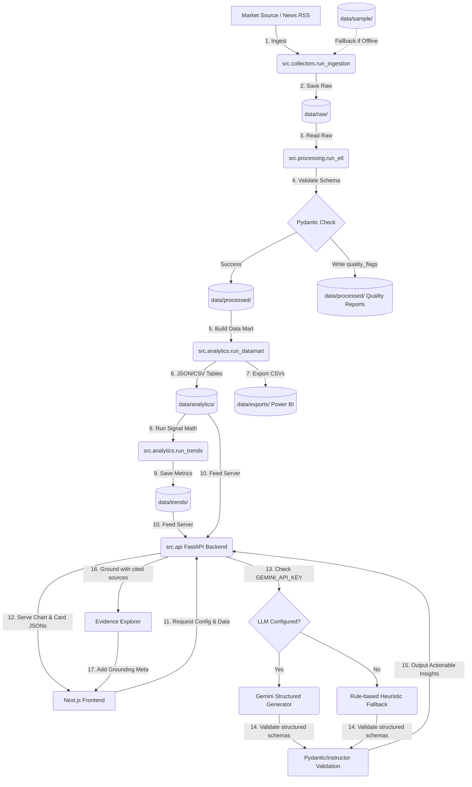

# MarketPulse AI Architecture Specification

This document details the software architecture, data flow pipelines, and team role mappings for MarketPulse AI.

---

## Technical Architecture Overview

MarketPulse AI is built as a decoupled, multi-layered data and AI system. The backend focuses on robust data collection, ETL, trend analysis, and REST API delivery. The frontend presents a premium, data-driven BI dashboard.

### Systems Block Diagram

```text
┌────────────────────────────────────────────────────────────────────────┐
│                          1. DATA PIPELINE LAYER                        │
│                                                                        │
│  [ RSS feeds / Google News ]                                           │
│              │ (Keyword queries)                                       │
│              ▼                                                         │
│     src.collectors.run_ingestion ◄──► [ data/sample/ (fallback) ]      │
│              │ (Raw JSON containing stable SHA-256 IDs)                │
│              ▼                                                         │
│     data/raw/feed_*.json                                               │
│              │                                                         │
│              ▼                                                         │
│     src.processing.run_etl (Cleans summaries, parses dates)            │
│              │                                                         │
│              ├──────────────────────────────────┐                      │
│              ▼                                  ▼                      │
│     data/processed/valid_*.json         data/processed/report_*.json   │
│     (Strict Pydantic schemas)          (Data Quality validation flags) │
└──────────────┬──────────────────────────────────┬──────────────────────┘
               │                                  │
┌──────────────▼──────────────────────────────────▼──────────────────────┐
│                            2. ANALYTICS LAYER                          │
│                                                                        │
│  src.analytics.run_datamart (Aggregates processed feeds)               │
│              │                                                         │
│              ├──────────────────────────────────┐                      │
│              ▼                                  ▼                      │
│     data/analytics/ (JSON/CSV files)      data/exports/*.csv           │
│     (Structured analytics tables)         (Power BI Compatibility)     │
│              │                                                         │
│              ▼                                                         │
│  src.intelligence.run_trends (Calculates keyword frequency & signals)  │
│              │                                                         │
│              ▼                                                         │
│     data/trends/trend_metrics.json                                     │
└──────────────┬─────────────────────────────────────────────────────────┘
               │
┌──────────────▼─────────────────────────────────────────────────────────┐
│                              3. API LAYER                              │
│                                                                        │
│  src.api.main (FastAPI Backend Server)                                 │
│              │ (REST Endpoints / API Routes: serving data & configs)   │
└──────────────┬─────────────────────────────────────────────────────────┘
               │
┌──────────────▼─────────────────────────────────────────────────────────┐
│                      4. WEB DASHBOARD & INSIGHT LAYERS                 │
│                                                                        │
│  [ Professional Web BI Dashboard (Next.js App) ]                       │
│    ├── KPI Cards & Recharts Visualizations (Data-driven views)          │
│    └── Citation & Evidence Panels (Grounded UI elements)               │
│              │                                                         │
│              ▼ (Queries business insights via backend API)             │
│  [ AI Insight Generator (Gemini LLM / Rule-based Fallback) ]           │
│    ├── Grounded prompt injection via Evidence Explorer (RAG)           │
│    └── Strict Pydantic output verification                             │
└────────────────────────────────────────────────────────────────────────┘
```

---

## Detailed Data Flow

The lifecycle of market signal processing flows sequentially through the following stages:



1. **Ingestion Flow**: Data collection executes RSS fetching with stable SHA-256 hashes generated from the URL (or concatenated title + keyword) to serve as unique IDs.
2. **ETL Flow**: Schema validator models incoming logs, checks URLs, tags anomalies as flags, outputting a quality statistics JSON file alongside clean deduplicated payloads.
3. **Analytics Mart Flow**: Converts processed article data into analytics-ready CSV/JSON tables for KPI metrics, source quality analysis, trend metrics, and future dashboard/API consumption. SQLite or DuckDB may be considered later only if querying requirements become more complex.
4. **Backend API Flow**: Exposes clean JSON structures returning both data arrays (e.g. chart values) and visualization layouts (e.g. axes titles, colors).
5. **Dashboard Presentation Flow**: Renders views dynamically from API specs, avoiding hardcoding structures on the frontend.
6. **Insight Flow**: If `GEMINI_API_KEY` is active, backend calls Google Gemini to output a structured JSON containing a summary, critical trends, and impact metrics. If not, it falls back to heuristics templates.
7. **RAG & Citation Flow**: Attaches precise source document identifiers (`id`, `url`, `title`, `trend_score`) as proof fields within the generated insight object, rendering clickable citations on the user dashboard.

---

## Project Role Mapping

To optimize developer collaboration, tasks are mapped to technical profiles:

### 1. Data Engineer
- **Responsibilities**: Modules 1, 2, 3, and 10.
- **Focus Area**: Scraping, file and data storage structures, ETL robustness, Pydantic data schemas, file organization, scheduler integrations (Prefect/n8n), and pipeline performance.

### 2. Data Analyst
- **Responsibilities**: Modules 4 and 11 (metrics and export checks).
- **Focus Area**: Designing mathematical formulas for trend scores, keyword weighting heuristics, validating export layouts, confirming Power BI CSV export schemas match analytics expectations.

### 3. AI Engineer
- **Responsibilities**: Modules 7, 8, and 9.
- **Focus Area**: Structuring prompt templates, configuring Gemini API integrations, implementing rule-based insight fallbacks, implementing validation schemas for structured LLM outputs, executing RAG indexing, and calculating LLM evaluation metrics (grounding, hallucinations).

### 4. Fullstack Web / BI Engineer
- **Responsibilities**: Modules 5, 6, and 11.
- **Focus Area**: Creating FastAPI backend routes, modeling endpoint schemas, structuring Next.js frontend pages, styling custom CSS layouts, loading charts via Recharts, and connecting API triggers.

### 5. DevOps / platform Engineer
- **Responsibilities**: Module 12.
- **Focus Area**: Writing Docker configurations, managing multi-stage builds, designing Github Action CI workflows, managing secret variables, and deploying staging pipelines.
